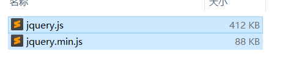
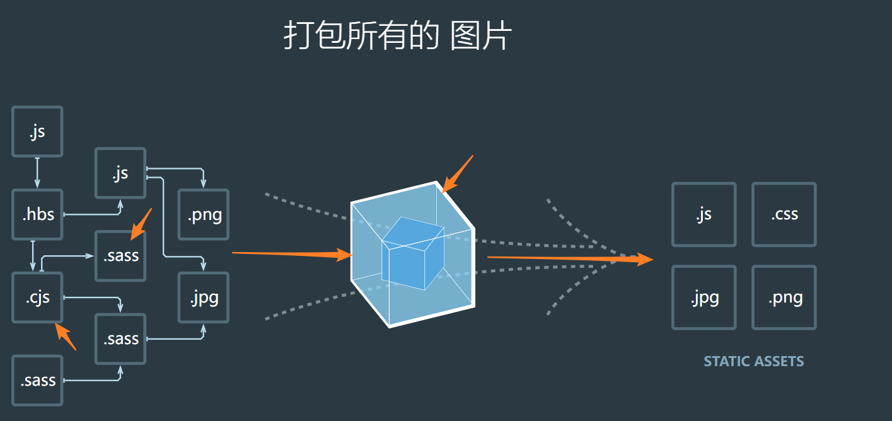
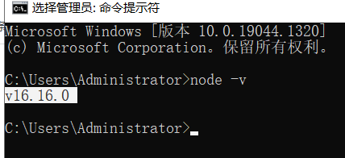
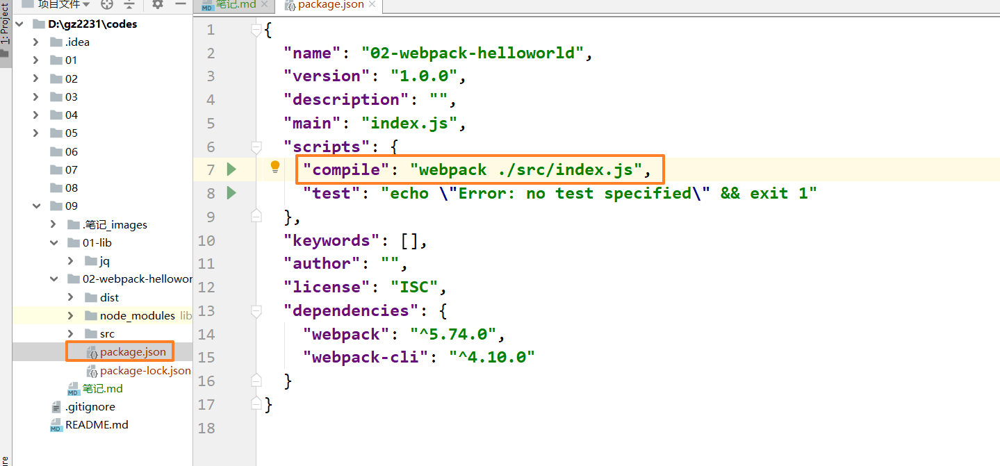
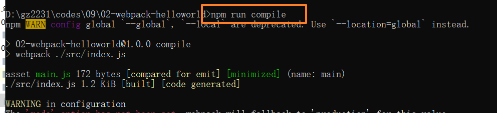

#                                                                                    课程目标

- webpack


# 前端面临的困境

- 开发的时候，我们写的代码是有注释，有空格在开发环境中注释有意义的，但是在生产环境中，注释是没有意义的。代码应该是尽可能压缩的足够小如果我们没有借助一些其他工具的时候，我们需要手工的把 xxx.js 转换 xxx.mini.js 文件。
    - jquery.js
    - jquery.min.js
    

- 我们的 js 在发展的过程中，出现很多的新特性，例如 es6 箭头函数、class 语法糖，Promise 等。这些新的特性在不做处理的时候是很难在低版本的浏览器适应。
    - let const class
    - var 构造function

- 我们的 css 开发，在发展过程中，也出现一些预处理的 css，例如 less sass stylus 等....这些预处理的 css 写起来非常的方便，但是这些预处理的文件浏览器默认是不支持的，则我们需要做转换。

思考：如何去解决上面的问题？ 

答：在发展的过程中，出现了很多的解决方案。

- 手工处理
  - xxx.js ====压缩的工具====xxx.mini.js 文件
  - https://www.jsjiami.com/jiemi.html
  
- 老牌的第三方的自动化构建化工具

  - grunt
    - https://www.gruntjs.net/getting-started
    
  - gulp
    - https://www.gulpjs.com.cn/
    
  - rollup
    - 尤雨溪（尤大大）(vuejs之父) 发布 vue3的时候，随便发布了一个 vue3 的脚手架工具，也可以叫做前端自动化构建工具，叫做 vite。 vite 底层使用的就是 rollup，所以现在 rollup 又流行起来了。
    - https://vitejs.cn/
    - https://www.rollupjs.com/
    

- 现代自动化构建工具
  - webpack（4 5版本）
  - vite（风头最热）
  - ...

# webpack 简介




- https://webpack.docschina.org/
- https://www.webpackjs.com/

> webpack 是一个 第三方的 自动化的 构建工具，可以使得我们的项目开发完全的自动化，或者叫做工程化。可以做哪些自动化呢

- 可以实现类似：js 代码的压缩、合并
- js 兼容性的处理（es6\es7\es6+ --转换为--es5）
- 处理预处理的 css，还可以解决 css 兼容性问题
- 使得 css 模块化，可以在js文件直接引入图片
- 使用 图片二进制文件模块化，可以在 js文件直接引入图片
- babel是js编译工具,能将es6或者一些特殊语法做一些转换，只做文件转义，不做文件整合。
- webpack是一个打包工具，内置只能处理js，但是它可以加载很多的loader处理css,img,ts,vue等其他文件,最终输出js文件。
- webpack通过使用babel-loader使用Babel

在日常的开发中经常在一个index.html页面中引入多个css，js文件，会导致页面加载慢，所以有必要将他们合并为一个文件. 
主要打包原理就是先在跟目录建立一个src文件夹存放项目源码,比如css,js,html等.建立一个index.js作为入口文件.在index.js里面通过import引入其他css,js文件,然后在webpack.config.js里面配置打包后将index.js自动插入index.html.打包之后在根目录会多出一个dist文件夹,这个是也在webpack.config.js里面配置,可以配置打包之后文件存放路径和打包之后的js名称.不配置默认就是dist文件夹/main.js.打开index.html文件就能访问到该页面了.


# webpaack 的四个基本概念（面试）

## 入口

> 就是一个 js 文件，这个是项目执行的开始。我们尽可能做单一入口的开发。

- 入口文件一般都是使用一些比较新的特性编写的代码，例如 es6 es7
- 还可以直接引入 css 直接引入 图片....
- 这个入口文件里面做了很多的依赖，并且还有使用一些新的语法

## 出口

> 通过 webpack 构建工具把入口文件进行转换，生成的文件叫做出口文件，这种文件浏览器可以识别的。

## loaders

> 首先我们使用的 webpack 本身的能力很有限。它能够做转换出来主要是依赖第三方开发者为其提供的一些叫做 loaders 包（工具）进行处理。 webpack 调用这些 loaders 工具做的转换。webpack 是一个管理者，loaders 是 底下做事的工具。对不同的转换需要不同的 loader 进行处理，例如处理 js 新特性，需要使用 babel-loader ；less 文件需要使用 less-loder ；例如 .vue 单组件文件需要使用 vue-loader；

- https://www.webpackjs.com/loaders/

## plugins

> 也是的 webpack 提供的一种机制，可以扩充 webpack 的功能，用于 loaders 转换后的处理工作。

- https://www.webpackjs.com/plugins/

# webpack 的安装
1. 先看指南
- https://www.webpackjs.com/guides/

2. 再看概念
- https://www.webpackjs.com/concepts/

3. 再看配置信息
- https://www.webpackjs.com/configuration/

4. loader 和 plugins 插件的使用
- https://www.webpackjs.com/loaders/
- https://www.webpackjs.com/plugins/

前置条件（nodejs 版本最好是最新的  LTS）




注意：在安装这些开发工具包的时候，分为本地项目安装和全局安装，目前笔记推崇的安装方式的 本地项目安装，不建议使用全局安装。

什么是本地项目安装？
- 指的是这个工具包是安装当前项目的依赖里面，只针对当前这个项目生效，使用的使用是当前项目包里面提供的命令；各个独立项目都可以安装自己所依赖的工具的各个版本。

    - A 老项目 维护
        - webpack 4
    - B 新项目 开发
        - webpack 5

什么全局安装？
- 工具安装后，会在全局提供一个工具命令，如果出现了其他的版本要使用的话，则会出现版本冲突的文件，在全局下只能存在一个版本。所以这种方式目前是不推崇的。

- `-g` 代表全局安装，如果不加就是本地项目安装

```shell
> npm init -y

> npm i webpack webpack-cli 

or

> cnpm i webpack webpack-cli

or

> yarn add  webpack webpack-cli

```

- 如果在安装的时候，安装有些慢，有如下的解决方案
  - 【切换 npm 源】：我们可以切换一个 npm 下载镜像，切换为中国的 npm 淘宝镜像。
    
    - `npm config set registry https://registry.npm.taobao.org`
  - 【切换 cnpm 包管理器】：cnpm 是淘宝针对 npm 做了加强后提供的一个工具包。
    - https://npmmirror.com/
    - ` npm install -g cnpm --registry=https://registry.npmmirror.com` 这条命令必须以超级管理员身份执行
  - 【切换 yarn 包管理器】：yarn 是 facebook 出的一个新的包管理器，使用方式和 npm 类似。
    - `npm i -g yarn` yarn 包管理器，先要使用 npm 安装后才可以在命令行使用 yarn 命令，这条命令必须以超级管理员身份执行
    
    - https://www.yarnpkg.cn/
    
    - yarn add 包名 【安装包】
    
    - yarn remove 包名 【删除包】
    
    - yarn dev 【启动 package.json 里面的 scripts 字段里面的命令，不需要使用 npm run dev，里面的 run】
    
      

**执行完webpack安装命令后,在当前目录会多出一个node_modules文件夹,以后通过npm 下载的包都会放在该文件夹里面**

# webpack 的基本使用

## 规划如下的目录结构

```
-webpack-demo
    -node_modules
        -...
    -src
        - index.js

```

## 执行打包

```shell
> npx webpack ./src/index.js

```

- 第一种方式使用 npx 执行webpack命令 
    - 由于我们的工具安装是本地项目安装，则会把安装好的命令，放置在node_modules/.bin/webpack 命令。如果要执行这个命令，我们可以在命令前面加上 npx ，这样的话，就会去node_modules/.bin/webpack。如果不加在就去全局找，由于全局没有安装，会报错。 
    ```
    D:\gz2231\codes\09\02-webpack-helloworld\node_modules\.bin
    ```
    - https://www.ruanyifeng.com/blog/2019/02/npx.html
    
- 第二种方式使用 package.json 里面的命令配置执行

    - 配置 
    - 执行 


## 参数配置

- -o 指定打包输出目录
- --mode=development|production 指定打包环境
- -w 监视文件的变化

# 配置文件的使用

```javascript
const path = require("path");

module.exports = {
  mode: "development",
  entry: "./src/index.js",
  output: {
    path: path.resolve(__dirname, "dist"),
    filename: "bundle.js",
  },
};
```

如果当前目录没有output所定义的文件夹,会自动创建

# 配置为 npm 命令

- 在 package.json 文件的 scripts 字段增加如下命令

```
"scripts": {
    "dev": "webpack -w  --config webpack.config.js"
  }
```

- 以后可以通过 `npm run dev` 启动打包

# loader 的使用

需要先安装webpack才能使用

> webpack 本身能处理的资源非常有限，这个时候，我们需要借助 loader 来进行翻译工作，转换成浏览器可以识别的模块化代码。

- webpack 本身能够处理 js/json 资源
- webpack 不能处理 css/img/fonts 等资源
- 能够处理 es6 模块化规范
- 生成环境代码会进行压缩和优化

## babel-loader 的基本使用

先安装babel-loader

```
npm install babel-loader --save
```

- https://v4.webpack.docschina.org/loaders/babel-loader/

- https://www.babeljs.cn/docs/usage

- 在 `webpack.config.js` 完成如下配置

```javascript
const path = require("path");

module.exports = {
  mode: "development",
  entry: "./src/index.js",
  output: {
    path: path.resolve(__dirname, "dist"),
    filename: "bundle.js",
  },
  module: {
    rules: [
      {
        test: /\.m?js$/,
        exclude: /(node_modules|bower_components)/,
        use: {
          loader: "babel-loader",
          options: {
            presets: ["@babel/preset-env"],
          },
        },
      },
    ],
  },
};
```

- 在项目根目录下创建 `babel.config.json` 文件

```json
{
  "presets": [
    [
      "@babel/preset-env",
      {
        "targets": {
          "ie": "6",
          "edge": "17",
          "firefox": "60",
          "chrome": "67",
          "safari": "11.1"
        },
        "useBuiltIns": "usage",
        "corejs": "3.6.5"
      }
    ]
  ]
}
```

## css-loader 的基本使用

- 安装如下的 loader

```shell
> npm i css-loader style-loader

```

- css-loader 可以把 css 代码转换为 js 可以识别的模块化代码。
- style-loader 可以把转换后的 css 模块化代码插入到网页的 header 的 style 标签里面

- 在 `webpack.config.js` 的`moudle` 的 `rules` 字段增加如下配置

```javascript
{
  rules: [
    //....
    {
      test: /\.css$/,
      use: [
        "style-loader", // 将 JS 字符串生成为 style 节点

        "css-loader", //  将 CSS 转化成 CommonJS 模块
      ],
    },
    //....
  ];
}
```

## less-loader 的基本使用

```shell
> npm i less less-loader


```

- 在 `webpack.config.js` 的`moudle` 的 `rules` 字段增加如下配置

```javascript
rules: [
  {
    test: /\.css|\.less$/,
    use: ["style-loader", "css-loader"],
  },
  // ... 方式在 css-loader 处理之后
  {
    test: /\.less$/,
    use: [
      "style-loader", // 将 JS 字符串生成为 style 节点
      "css-loader", //  将 CSS 转化成 CommonJS 模块
      "less-loader",
    ],
  },
];
```

## sass-loader 的基本使用

```shell
> npm i sass-loader

```

- 注意 `node-sass` 的安装使用如下操作

```shell
npm i node-sass --sass_binary_site=https://npm.taobao.org/mirrors/node-sass/
```

- 在 `webpack.config.js` 的`moudle` 的 `rules` 字段增加如下配置

```javascript
rules: [
  {
    test: /\.css|\.less$/,
    use: ["style-loader", "css-loader"],
  },
  // ... 方式在 css-loader 处理之后
  {
    test: /\.scss$/,
    use: [
      "style-loader",
      "css-loader",
      "sass-loader", // 将 Sass 编译成 CSS，默认使用 Node Sass
    ],
  },
];
```

## url-loader 的基本使用

```shell
> npm install file-loader url-loader
```

- 在 `webpack.config.js` 的`moudle` 的 `rules` 字段增加如下配置

```javascript
module.exports = {
  module: {
    rules: [
      {
        test: /\.jpg|png|gif|bmp|ttf|eot|svg|woff|woff2$/,
        loader: "url-loader",
        options: {
          publicPath: "./image", // 相对打包后的index.html的图片位置
          outputPath: "image/", // 输出到build的目录image下
          // 图片小于 10kb,会被 base64处理
          limit: 10 * 1024,
          // 解决：关闭url-loader的es6模块化，使用commonjs解析
          esModule: false,
          // 给图片重命名
          name: "[name].[hash:6].[ext]",
        },
        type: "javascript/auto",
      },
    ],
  },
};
```

- 注意事项
  - https://blog.csdn.net/qq_52622178/article/details/123351774
  - https://blog.csdn.net/qq_39446719/article/details/88418444

# plugin 插件的使用

## HtmlWebpackPlugin

```shell
> npm install html-webpack-plugin

```

```javascript
const HtmlWebpackPlugin = require("html-webpack-plugin");

{
  plugins: [
    new HtmlWebpackPlugin({
      template: "./src/index.html",//把打包后的js文件自动插入到当前的这个模板
    }),
  ]
}
```

## webpack-dev-server

[](https://www.webpackjs.com/configuration/dev-server/)

> webpack-dev-server 这个插件的底层：就是一个 webpack + .  webpack-dev-server 默认会将构建结果和输出文件全部作为开发服务器的资源文件，也就是说，只要通过 Webpack 打包能够输出的文件都可以直接被访问到 .它是基于express（nodejs） 框架，提供一个 web 服务。

```shell
> npm i webpack-dev-server

```

- 启动

```shell
> npx webpack serve --open

```

- 注意：使用插件后，生成的 index.html 文件和 bundle.js 文件是在内存里面，并不会实时写入到 dist 文件下。
  - 主要是为了提升效率，现在是开发阶段，没必要每次都把打包文件实时写入到磁盘，写入磁盘是 IO 操作，一般 IO 操作是很慢的。
  
  
### 基本配置

```
devServer: {
  // 提供web服务的文件路径
    static: {
               directory: path.join(__dirname, './dist')
            },
    // 启动gzip压缩使得 访问更快
    compress: true,
    // 配置启动服务器的端口号
    port: 3000,
    // 配置是否自动打开浏览器 
    open: true,
    //配置浏览器启动默认打开的文件 不设置默认index.html
    openPage:'dist/test.html'
  }
```


### 配置代理操作(在客户端配置)


```javascript
{
    devServer: {
            proxy:{ // 通过proxy属性添加代理服务配置,其中 每一个属性就是一个代理规则的配置
                '/api' :{// 属性的名称就是要被代理的请求路径前缀，它的值就是为这个前缀匹配到的代理规则配置
                    target:"http://localhost:3000",
                    // 代理后 就是在/api前面加上target所定义的地址.比如:http://localhost:8080/api/user/lst ==> http://localhost:3000/api/user/lst
                    // 因为我们实际要请求的地址是 http://localhost:3000/user/lst
                    // 所以我们需要通过重写的方式去掉/api
                    pathRewrite:{ // pathRewrite会以正则的方式去替换我们请求的路径
                        "^/api":"" // 把 api 替换为 ""，替换后的地址：http://localhost:8080/user/lst
                    },
                    changeOrigin:true
                }
            }
        }

}
```
